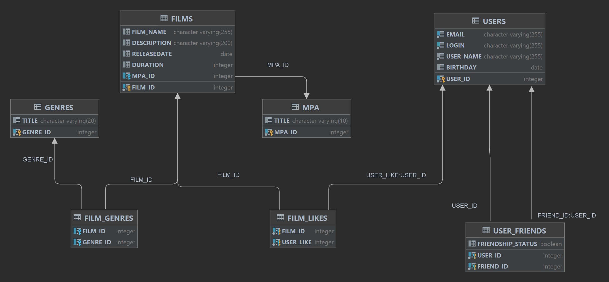

# java-filmorate
# Сервис рекомендации фильмов.
С помощюью данной программы поользователь помжет выбрать фильм на вечерний просмотр, ориентируясь на его рейтинг, жанр и возростные ограничения.
**********************************************************************************
### Основные функции приложения:
- создание / обновение / получение / удаление пользователей;
- добавление / удаление друзей, получение списка друзей;
- получение списка общих друзей;
- получение списка жанров фиьмовж
- получения списка возростных ограничений;
- лобавлен е / удаление лайков к фильмам;
- поручение рейтингов фильмов.

## Схема БД:

## Схема базы данных содержит семь таблиц:
1. USERS - данные о пользователи;
2. FILMS - данные о фильмах;
3. USER_FRIENDS - данные о друзьях пользователя;
4. GENRES - данные о всех возможных жанрах фильмов.
5. FILM_GENRES - жанры каждого фильма
6. FILM_LIKES - данные о лайках к фильму
7. MPA - все возможные возрастные ограничения
